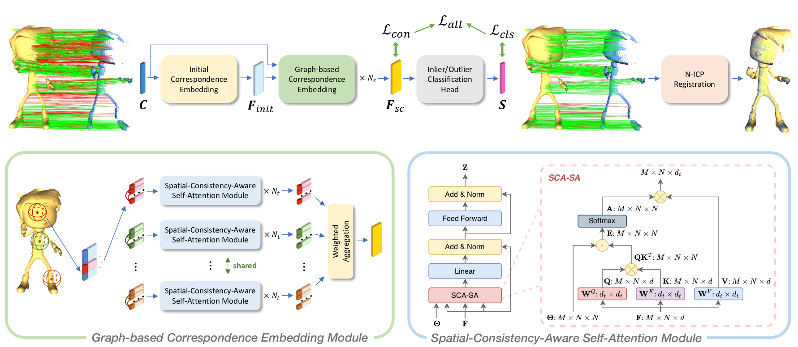

# Deep Graph-Based Spatial Consistency for Robust Non-Rigid Point Cloud Registration

PyTorch implementation of the paper:

[Deep Graph-Based Spatial Consistency for Robust Non-Rigid Point Cloud Registration](http://arxiv.org/abs/2303.09950)

[Zheng Qin](https://scholar.google.com/citations?user=DnHBAN0AAAAJ), [Hao Yu](https://scholar.google.com/citations?user=g7JfRn4AAAAJ),
Changjian Wang, Yuxing Peng, and [Kai Xu](https://scholar.google.com/citations?user=GuVkg-8AAAAJ).

## Introduction

We study the problem of outlier correspondence pruning for non-rigid point cloud registration. In rigid registration,
spatial consistency has been a commonly used criterion to discriminate outliers from inliers. It measures the
compatibility of two correspondences by the discrepancy between the respective distances in two point clouds. However,
spatial consistency no longer holds in non-rigid cases and outlier rejection for non-rigid registration has not been
well studied. In this work, we propose Graph-based Spatial Consistency Network (GraphSCNet) to filter outliers for
non-rigid registration. Our method is based on the fact that non-rigid deformations are usually locally rigid, or local
shape preserving. We first design a local spatial consistency measure over the deformation graph of the point cloud,
which evaluates the spatial compatibility only between the correspondences in the vicinity of a graph node. An
attention-based non-rigid correspondence embedding module is then devised to learn a robust representation of non-rigid
correspondences from local spatial consistency. Despite its simplicity, GraphSCNet effectively improves the quality of
the putative correspondences and attains state-of-the-art performance on three challenging benchmarks.



## News

2023.06.15: Code and models on 4DMatch released.

2023.02.28: This work is accepted by CVPR 2023.

## Installation

Please use the following command for installation:

```bash
# 1. It is recommended to create a new environment
conda create -n geotransformer python==3.8
conda activate geotransformer

# 2. Install vision3d following https://github.com/qinzheng93/vision3d
```

The code has been tested on Python 3.8, PyTorch 1.13.1, Ubuntu 22.04, GCC 11.3 and CUDA 11.7, but it should work with
other configurations.

## 4DMatch

### Data preparation

The 4DMatch dataset can be downloaded from [DeformationPyramid](https://github.com/rabbityl/DeformationPyramid). We
provide the correspondences extracted by GeoTransformer in the release page. The data should be organized as follows:

```text
--data--4DMatch--train--abe_CoverToStand
              |      |--...
              |--val--amy_Situps
              |    |--...
              |--4DMatch-F--AJ_SoccerPass
              |          |--...
              |--4DLoMatch-F--AJ_SoccerPass
              |            |--...
              |--correspondences--val--amy_Situps
                               |    |--...
                               |--4DMatch-F--AJ_SoccerPass
                               |          |--...
                               |--4DLoMatch-F--AJ_SoccerPass
                                            |--...
```

### Training

The code for 4DMatch is in `experiments/graphscnet.4dmatch.geotransformer`. Use the following command for training.

```bash
CUDA_VISIBLE_DEVICES=0 python trainval.py
```

### Testing

Use the following command for testing.

```bash
# 4DMatch
CUDA_VISIBLE_DEVICES=0 python test.py --test_epoch=EPOCH --benchmark=4DMatch-F
# 4DLoMatch
CUDA_VISIBLE_DEVICES=0 python test.py --test_epoch=EPOCH --benchmark=4DLoMatch-F
```

`EPOCH` is the epoch id.

We also provide pretrained weights in `weights`, use the following command to test the pretrained weights.

```bash
CUDA_VISIBLE_DEVICES=0 python test.py --checkpoint=/path/to/GraphSCNet/weights/graphscnet.pth --benchmark=4DMatch-F
```

Replace `4DMatch` with `4DLoMatch` to evaluate on 4DLoMatch.

### Results

| Benchmark | Prec | Recall |  EPE  | AccS | AccR |  OR  |
|:----------|:----:|:------:|:-----:|:----:|:----:|:----:|
| 4DMatch   | 92.2 |  96.9  | 0.043 | 72.3 | 84.4 | 9.4  |
| 4DLoMatch | 82.6 |  86.8  | 0.121 | 41.0 | 58.3 | 21.0 |

## Citation

```bibtex
@inproceedings{qin2023deep,
    title={Deep Graph-Based Spatial Consistency for Robust Non-Rigid Point Cloud Registration},
    author={Zheng Qin and Hao Yu and Changjian Wang and Yuxing Peng and Kai Xu},
    booktitle={Proceedings of the IEEE/CVF Conference on Computer Vision and Pattern Recognition (CVPR)},
    month={June},
    year={2023},
    pages={5394-5403}
}
```

## Acknowledgements

- [vision3d](https://github.com/qinzheng93/vision3d)
- [GeoTransformer](https://github.com/qinzheng93/GeoTransformer)
- [PointDSC](https://github.com/XuyangBai/PointDSC)
- [lepard](https://github.com/rabbityl/lepard)
- [DeformationPyramid](https://github.com/rabbityl/DeformationPyramid)